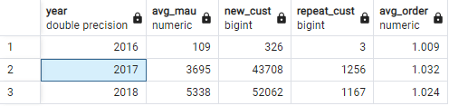
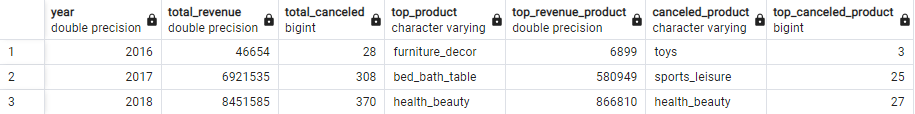
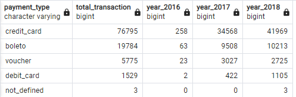
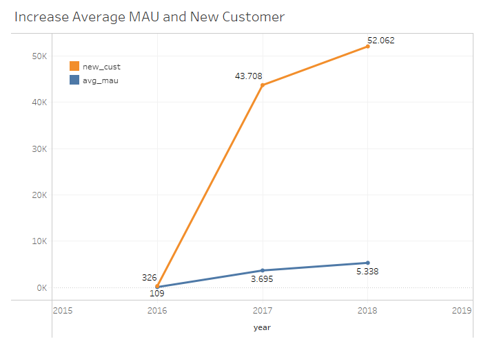
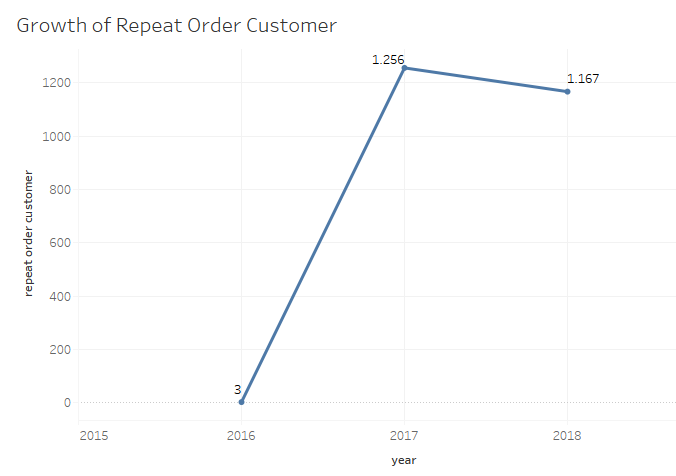
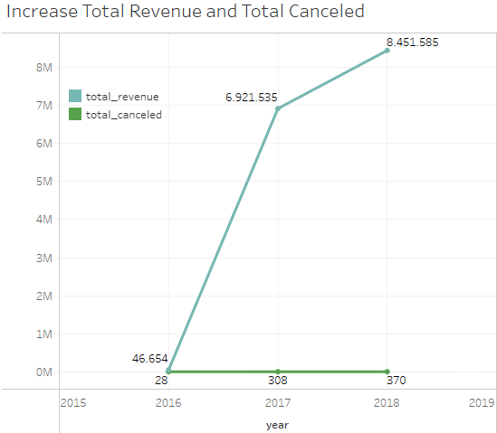
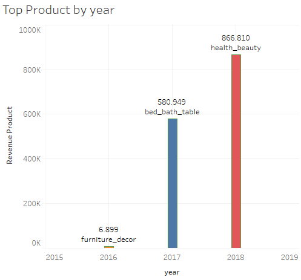
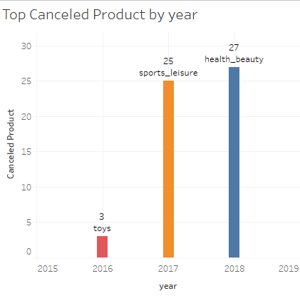
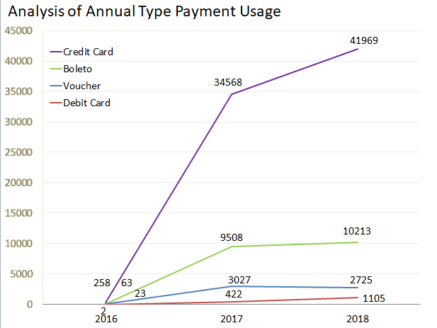

# Analyzing-Business-Performance
Dataset: [link source](https://drive.google.com/drive/folders/1QyWjg_rv443DEyBQFNtiK9IHXAeG8eIW?usp=share_link)
# Analyze eCommerce Business Performance with SQL

## Goals
Analyze business performance which consists of three aspects including customer growth, product quality and type of payment 

## Steps
1. Preparing raw data into structured data, ready to be processed and create Entity Relationship Diagram (ERD) [here](https://drive.google.com/file/d/1RLgKcfFC4NdSNoWkiyKxnjlFEIUunZ6f/view?usp=share_link)

2. Analyzing business performance from three aspects including:
    a. Annual Customer Activity Growth Analysis
    b. Annual Product Category Quality Analysis
    c. Analysis of Annual Payment Type Usage
3. Create a visualization of the analysis results with tableau

## Analysis Result
1. Annual Customer Activity Growth Analysis

2. Annual Product Category Quality Analysis

3. Analysis of Annual Payment Type Usage

## Insight
1. Monthly Active User (MAU) and new customers have increased every year. In 2016 there was a very significant difference from 2017 and 2018. This is because the available data began in September 2016.

2. Customers who repeat orders have increased from 2016 to 2017, but have decreased from 2017 to 2018.

3. Total product revenue and total canceled products have increased every year.

4. The total of revenue product has increased every year and the categories being the best sellers are different.

5. The total of canceled products has increased every year and the top product categories that have been canceled are different.

6. The most used type of payment is by Credit Card

